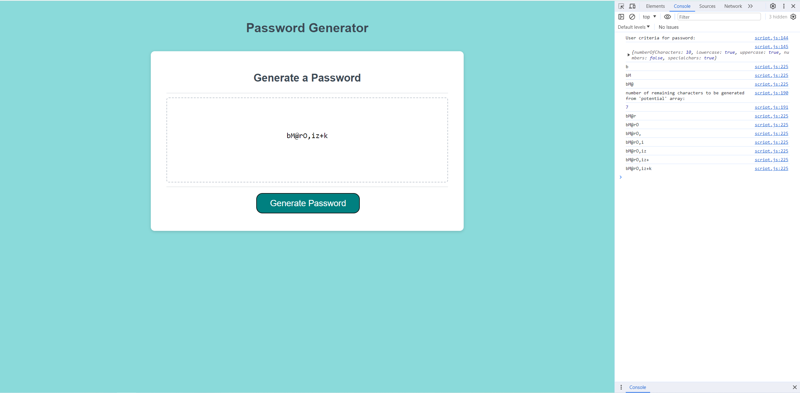

# password-generator
A password generator tool created for Bootcamp week 5 challenge

## Description

This is a JavaScript project to generate a password based on a user's requirements, i.e. length and types of characters to be included in the password. The code takes five inputs from the user and stores them to meet their needs, as well as including error messages for if the user provides an invalid input (e.g. entering a value that is not a number for password length, or not selecting any character types).

It uses four arrays containing different character types (lowercase, uppercase, special characters and numbers), and generates a secure password from these to meet the user's needs. 

The project was a good opportunity to further the JavaScript skills learnt in Week 5 of the Front-End Web Development bootcamp and further my logical thinking to solve problems using code. 

Completing the challenge required the creation of several functions, use of objects, if...else loops and application of new functions such as math.random and NaN. Pseudocoding the challenge before beginning the JS was incredibly helpful as it allowed the code to be broken down into more manageable, code-able 'chunks' that made the challenge less overwhelming.

## Installation

* Copy the following link: https://github.com/rosiegalezia/password-generator.git

* Open Git Bash

* Change the current working directory to the desired location for the cloned directory using the cd command

* Use the command git clone followed by the url https://github.com/rosiegalezia/password-generator.git and press enter to clone locally

## Usage

The deployed site is available at: https://rosiegalezia.github.io/password-generator/

A screenshot of the site and its console log can be seen below: 

## Credits

N/A

## License

MIT License

Copyright (c) 2023 rosiegalezia

Permission is hereby granted, free of charge, to any person obtaining a copy of this software and associated documentation files (the "Software"), to deal in the Software without restriction, including without limitation the rights to use, copy, modify, merge, publish, distribute, sublicense, and/or sell copies of the Software, and to permit persons to whom the Software is furnished to do so, subject to the following conditions:

The above copyright notice and this permission notice shall be included in all copies or substantial portions of the Software.

THE SOFTWARE IS PROVIDED "AS IS", WITHOUT WARRANTY OF ANY KIND, EXPRESS OR IMPLIED, INCLUDING BUT NOT LIMITED TO THE WARRANTIES OF MERCHANTABILITY, FITNESS FOR A PARTICULAR PURPOSE AND NONINFRINGEMENT. IN NO EVENT SHALL THE AUTHORS OR COPYRIGHT HOLDERS BE LIABLE FOR ANY CLAIM, DAMAGES OR OTHER LIABILITY, WHETHER IN AN ACTION OF CONTRACT, TORT OR OTHERWISE, ARISING FROM, OUT OF OR IN CONNECTION WITH THE SOFTWARE OR THE USE OR OTHER DEALINGS IN THE SOFTWARE.